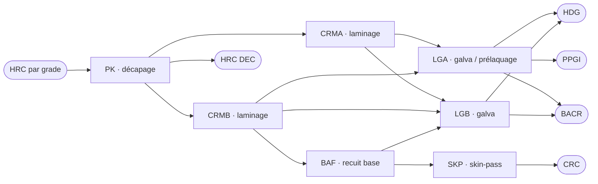

# Simulateur Capacité–Commande Maghreb Steel — Livrables rédigés

*Optimisation linéaire multi-périodes du laminage à froid de Tit Mellil. Ce document couvre les questions de compréhension (E1–E4), la formulation mathématique (E5–E10), les résultats et leur analyse (E13–E24), avec les extensions bonus correspondantes. Les chiffres cités sont la sortie réelle du modèle résolu par CBC sur le jeu de données fourni.*

---

## Partie I — Compréhension du problème

### E1. La question business

Le carnet de commandes représente 16 958 T à produire sur quatre semaines, pour une capacité de transformation qui plafonne nettement en dessous. La question n'est donc pas « combien coûte ce plan ? » mais **« quel sous-ensemble de commandes accepter, par quelle route métallurgique les produire et à quelle semaine, pour dégager la marge sur coût variable la plus élevée, sans violer aucune contrainte d'usine ? »**.

La différence avec un simple calcul de coût est qu'un calcul de coût évalue *un* plan qu'on lui soumet : on lui donne les tonnages, il rend une facture. Ici, le plan n'existe pas encore — c'est précisément l'inconnue. Le simulateur doit explorer un espace de décisions couplées (acceptation, routage, calendrier) sous des contraintes qui se gênent mutuellement (une tonne de PPGI mobilise du HRC rare *et* la ligne galva, qu'elle dispute à du HDG), et en retenir la meilleure combinaison. Surtout, il produit une information qu'aucun chiffrage ne donne : les **coûts d'opportunité** (combien rapporterait une tonne de HRC ou un jour de ligne en plus) et la **raison de chaque refus**. C'est cette information qui transforme un calcul en outil de décision.

### E2. Schéma de flux par famille

Le HRC décapé sur PK alimente deux laminoirs à froid, CRMA et CRMB, qui se partagent ensuite les lignes aval. Le graphe complet :

Lu famille par famille, en distinguant **points de branchement** (le modèle choisit) et **points de confluence** (plusieurs flux se rejoignent sur une même ligne) :

| Famille | Route(s) | Branchements à décider |
|---|---|---|
| **CRC** | PK → CRMB → BAF → SKP | aucune : voie unique |
| **HRC DEC** | PK | aucune (décapage seul) |
| **HDG** | PK → {CRMA \| CRMB} → {LGA \| LGB} | laminoir **et** ligne galva → 4 routes |
| **PPGI** | PK → {CRMA \| CRMB} → LGA | laminoir seulement (LGA imposée) → 2 routes |
| **BACR** | voie A : PK → CRMB → BAF → LGB ; voie B : PK → {CRMA \| CRMB} → {LGA \| LGB} | voie A/B + laminoir + galva → 5 routes |

Les confluences sont les ressources partagées : **PK** voit passer toutes les familles ; **CRMB** sert CRC, HDG, PPGI et BACR ; **LGA** reçoit HDG, PPGI et BACR ; **LGB** reçoit HDG et BACR ; **BAF** est commun à CRC et à BACR voie A. Ce sont ces confluences qui créent la concurrence pour la capacité, et donc l'arbitrage.

Deux règles métier resserrent le graphe et ne doivent pas être oubliées : le PPGI ne peut sortir que par LGA (LGB ne prélaque pas), et BAF/SKP ne sont alimentés que par CRMB — jamais par CRMA. C'est ce qui force toute la filière CRC et la voie A du BACR à passer par CRMB.

### E3. Familles et grades les plus contraints (avant calcul)

En rapprochant la demande par grade de la disponibilité HRC annoncée, trois grades sautent aux yeux comme limitants :

| Grade | Demande (T) | Dispo HRC (T) | Ratio |
|---|---|---|---|
| **S320** | 1 935 | 800 | **2,4×** |
| **DX51** | 4 405 | 3 200 | **1,4×** |
| DX52 | 1 572 | 1 500 | 1,05× |
| DC01 | 6 460 | 6 750 | 0,96× (juste tenable) |
| DD13 | 2 829 | 3 750 | 0,75× (confortable) |

Le S320 et le DX51 sont structurellement sur-demandés : il sera impossible de tout honorer sur ces deux grades, peu importe la capacité machine. Le DC01 est sur le fil, le DD13 a de la marge.

Côté familles, l'intuition est que les produits qui passent par la **galvanisation** (HDG, PPGI, BACR voie directe) se disputeront LGA/LGB, et que le **PPGI** est le plus exposé puisqu'il n'a que LGA. Le **CRC**, lui, est le seul à dépendre de l'enchaînement CRMB → BAF → SKP : sa capacité dépend d'un BAF lent (180 T/j) et d'un CRMB qu'il partage avec les familles à forte marge. On s'attend donc à ce que le CRC soit la variable d'ajustement. *La résolution confirme exactement cette lecture : PPGI servi à 100 %, CRC à 51 %, et la quasi-totalité des refus sur les grades S320/DX51 (voir E17).*

### E4. Les trois leviers du planificateur

Un planificateur qui veut honorer plus de commandes peut jouer sur trois leviers :

1. **La disponibilité de HRC par grade** — c'est la matière première, le poste qui domine le coût. En acheter plus sur les grades rares lève directement le plafond.
2. **La capacité des lignes** — soit en investissant dans la cadence d'un goulot, soit en déplaçant les arrêts préventifs hors des semaines tendues.
3. **Le routage et le choix des commandes** — pour chaque produit galvanisable, choisir CRMA ou CRMB en amont et LGA ou LGB en aval ; pour le BACR, voie BAF ou voie directe ; et, globalement, décider quelles commandes accepter et lesquelles refuser.

Dans notre modèle, le levier 3 est **endogène** : ce sont les variables de décision. Le routage est représenté par des variables de production indexées par route, et l'acceptation par le tonnage livré de chaque commande. Les leviers 1 et 2 sont des **paramètres fixés** dans le modèle de base — disponibilité HRC, cadences, calendrier d'arrêts sont des données. Ils deviennent intéressants en **analyse de sensibilité** : on les fait bouger pour mesurer leur impact (E20, E21) et on lit leur valeur marginale dans les *shadow prices* (E18). C'est la bonne façon de raisonner : on optimise sur ce qu'on contrôle au quotidien (le mix et le routage), et on chiffre ce que coûterait de relâcher ce qu'on ne contrôle pas à court terme (la matière et les machines).

> **B1 (vision directeur commercial).** Au-delà du plan, la question qu'on aimerait trancher est : *« à partir de quel prix une nouvelle commande sur tel grade vaut-elle la peine d'être prise, compte tenu de ce qu'elle déplace ? »*. C'est exactement le coût d'opportunité que donne le modèle. Une commande n'est rentable que si son prix dépasse son coût variable **plus** la valeur des ressources rares qu'elle consomme — soit, pour une tonne sur grade rare, le coût HRC + transfo + le *shadow price* du grade. On l'intègre sans rien réécrire : il suffit d'évaluer une commande candidate à l'aune des duals courants (c'est ce que fait le scénario E22), ce qui donne un « prix plancher d'acceptation » directement exploitable par le commerce.

---

## Partie II — Formulation mathématique

C'est le cœur du projet. Le modèle est un **programme linéaire continu** (Niveau 2) : on autorise le service partiel d'une commande, ce qui garde le problème linéaire et rend les *shadow prices* exploitables. Les variables binaires (campagnes) relèvent du Niveau 3 et sont décrites en extension (B4).

### Ensembles et indices

| Symbole | Ensemble |
|---|---|
| $c \in \mathcal{C}$ | commandes retenues (les 66 du carnet, **moins le Quarto** exclu du périmètre, soit 65) |
| $f \in \mathcal{F}$ | familles : CRC, HDG, PPGI, BACR, HRC DEC |
| $g \in \mathcal{G}$ | grades : DC01, DD13, DX51, DX52, S320 |
| $\ell \in \mathcal{L}$ | lignes : PK, CRMA, CRMB, BAF, SKP, LGA, LGB |
| $t \in \mathcal{T}$ | semaines : 1, 2, 3, 4 |
| $r \in \mathcal{R}_c$ | routes admissibles pour la commande $c$ (selon sa famille, cf. E2) |

Chaque commande $c$ porte un grade $g_c$, une famille $f_c$, une épaisseur $e_c$, une largeur $w_c$, un tonnage demandé $D_c$, un prix $\pi_c$, une semaine de livraison $t_c$ et une priorité.

### Paramètres

Cadence $\kappa_{\ell,f}$ (T/jour), jours d'arrêt $a_{\ell,t}$, jours ouvrés $J=7$. Rendement $\rho_\ell$ et taux de chute $\sigma_\ell$ par process. Coût de transformation $\gamma_\ell^{(\tau)}$ (MAD par tonne de sortie, pour la tranche d'épaisseur $\tau$). Prix HRC $h_{g,w}$ et disponibilité $H_g$. Stock fini initial / minimum / maximum $S^0_f, S^{\min}_f, S^{\max}_f$. Prix des chutes $s = 1800$ ; surcoût zinc $z = 0{,}025 \times 18000 = 450$ MAD/T appliqué au HDG et au PPGI.

**Coefficients dérivés par route.** Pour une route $r = (\ell_1, \ell_2, \dots, \ell_{k})$ ordonnée de PK jusqu'au process de finition :

$$\Pi_r = \prod_{i=1}^{k}\rho_{\ell_i} \qquad\text{(rendement de la chaîne complète)}$$

$$\theta_{r,\ell_i} = \frac{1}{\displaystyle\prod_{j=i+1}^{k}\rho_{\ell_j}} \qquad\text{(tonnes en sortie de } \ell_i \text{ par tonne finie)}$$

On en déduit, par tonne finie de la commande $c$ via $r$ :

$$
\Gamma_{c,r} = \sum_{i=1}^{k}\gamma_{\ell_i}^{(\tau(e_c))}\,\theta_{r,\ell_i}
\;\;\text{(transfo)},\quad
\Lambda_{c,r} = \frac{h_{g_c,w_c}}{\Pi_r}
\;\;\text{(HRC)},\quad
\Xi_{c,r} = s\sum_{i=1}^{k}\sigma_{\ell_i}\frac{\theta_{r,\ell_i}}{\rho_{\ell_i}}
\;\;\text{(chutes)}
$$

et la **marge nette unitaire hors recette** de la route :

$$\mu_{c,r} = \Xi_{c,r} - \Gamma_{c,r} - \Lambda_{c,r} - z\cdot\mathbb{1}[f_c\in\{\text{HDG},\text{PPGI}\}]$$

### E5. Variables de décision

| Variable | Domaine | Indexation | Sens métier |
|---|---|---|---|
| $p_{c,r,\tau}$ | $\ge 0$ (continue) | commande $c$, route $r\in\mathcal{R}_c$, semaine de production $\tau \le t_c$ | tonnage **fini** de la commande $c$ produit par la route $r$ pendant la semaine $\tau$ |
| $x_c$ | $0 \le x_c \le D_c$ | commande $c$ | tonnage **livré** de la commande $c$ (à son échéance $t_c$) |
| $S_{f,t}$ | $S^{\min}_f \le S_{f,t} \le S^{\max}_f$ | famille $f$, fin de semaine $t$ | stock de produits finis ; $S_{f,0}=S^0_f$ fixé |

Deux partis pris méritent d'être explicités, car ils seront questionnés à l'oral. **D'abord, le service partiel** : $x_c$ varie continûment entre 0 et la demande. Une commande « refusée » est simplement une commande pour laquelle l'optimum donne $x_c = 0$. Ce choix préserve la linéarité (donc les duals) et reflète qu'en pratique on peut livrer un tonnage partiel. **Ensuite, la production en avance** : on autorise $\tau < t_c$, c'est-à-dire produire avant l'échéance et stocker. C'est ce qui rend le modèle réellement multi-périodes — le stock fini relie les semaines — et ce qui permet d'esquiver intelligemment les arrêts (produire la semaine où la ligne tourne pour livrer la semaine où elle est à l'arrêt). La production reste interdite après l'échéance dans le modèle de base ; le retard est traité en extension (B2).

### E6. Fonction objectif

On maximise la marge sur coût variable sur l'horizon :

$$
\max\; \underbrace{\sum_{c\in\mathcal{C}} \pi_c\, x_c}_{\text{recettes}}
\;+\; \sum_{c}\sum_{r\in\mathcal{R}_c}\sum_{\tau\le t_c}
\Big(\underbrace{\Xi_{c,r}}_{\text{chutes}} - \underbrace{\Gamma_{c,r}}_{\text{transfo}} - \underbrace{\Lambda_{c,r}}_{\text{HRC}} - \underbrace{z\,\mathbb{1}[f_c\in\{\text{HDG,PPGI}\}]}_{\text{zinc}}\Big)\, p_{c,r,\tau}
$$

Terme par terme. **Les recettes** valorisent ce qui est livré au prix négocié. **Le coût HRC** $\Lambda_{c,r}$ est le poste dominant : il achète $1/\Pi_r$ tonnes de HRC par tonne finie, au prix du grade et de la largeur de la commande — d'où le facteur de rendement de chaîne (une tonne livrée a consommé davantage de matière, le reste est parti en chute/déclassé tout au long du parcours). **Le coût de transformation** somme les coûts de chaque process traversé, chacun pondéré par le tonnage réellement traité à ce stade $\theta_{r,\ell_i}$, et lu dans la bonne tranche d'épaisseur. **La valorisation des chutes** récupère 1 800 MAD par tonne de ferraille générée à chaque étape. **Le zinc** (450 MAD/T) ne s'applique qu'aux familles galvanisées avec dépôt, soit HDG et PPGI.

Deux précisions sur les coûts annexes. La peinture du PPGI n'apparaît pas séparément : le barème de coût indique que `LGA-PPGI` l'intègre déjà (c'est pourquoi LGA-PPGI est plus cher que LGA-HDG d'environ 100 MAD/T) ; l'ajouter une seconde fois serait un double comptage. Le BACR, bien qu'il transite par LGA/LGB, n'est pas réellement galvanisé dans le périmètre du projet (`pas de galvanisation`, par hypothèse) : pas de zinc pour lui. Enfin, le déclassé et le non-conforme ne sont pas valorisés dans le modèle de base — c'est un choix conservateur, leur revalorisation à 50 % / 20 % du prix étant un raffinement listé en limites (E24).

### E7. Contraintes de capacité

Une ligne qui sert plusieurs familles à des cadences différentes se modélise proprement en **jours-machine** : produire un tonnage donné consomme un nombre de jours égal au tonnage divisé par la cadence, et la somme sur toutes les familles ne peut excéder les jours disponibles.

$$
\sum_{c\in\mathcal{C}}\;\sum_{\substack{r\in\mathcal{R}_c\\ \ell\in r}}
\frac{\theta_{r,\ell}}{\kappa_{\ell,f_c}}\; p_{c,r,t}
\;\le\; J - a_{\ell,t}
\qquad \forall\,\ell\in\mathcal{L},\;\forall\,t\in\mathcal{T}
$$

La capacité nette est bien $\text{cadence} \times (7 - \text{jours d'arrêt})$, exprimée ici en jours au membre de droite. Le calendrier d'arrêts entre donc directement par $a_{\ell,t}$ : LGA perd un jour en S1, CRMB et SKP un jour en S2, PK et LGB un jour en S3, CRMA deux jours en S4 — chacun rabote la semaine concernée. Mesurer le débit en sortie de process ($\theta_{r,\ell}$ étant le tonnage de sortie) garde la convention cohérente avec les cadences, qui sont exprimées en tonnes produites par jour.

### E8. Contraintes de bilan matière

Deux niveaux de conservation. **Au niveau de la commande**, le tonnage livré est égal au tonnage produit pour elle, sur toutes ses routes et toutes les semaines autorisées :

$$x_c = \sum_{r\in\mathcal{R}_c}\sum_{\tau\le t_c} p_{c,r,\tau} \qquad \forall\,c\in\mathcal{C}$$

**Au niveau du stock fini**, le stock de fin de semaine est le stock précédent, plus ce qui a été produit dans la famille cette semaine, moins ce qui est livré à échéance :

$$
S_{f,t} = S_{f,t-1}
+ \sum_{\substack{c:\,f_c=f}}\sum_{r} p_{c,r,t}
- \sum_{\substack{c:\,f_c=f\\ t_c=t}} x_c
\qquad \forall\,f\in\mathcal{F},\;\forall\,t\in\mathcal{T}
$$

avec $S_{f,0}=S^0_f$ et $S^{\min}_f \le S_{f,t}\le S^{\max}_f$. Le rendement est porté par les coefficients $\theta$ et $\Pi$ des routes : une tonne entrant dans un process n'en ressort que $\rho_\ell$ tonnes conformes, le reste partant en chute/déclassé/non-conforme. Concrètement, le tonnage en sortie de $\ell_i$ vaut $\theta_{r,\ell_i}$ par tonne finie, et le tonnage de HRC à l'entrée vaut $1/\Pi_r$ — c'est cette propagation des pertes le long de la chaîne qui fait qu'une tonne livrée mobilise plus d'une tonne de matière en amont.

La borne de stock fonctionne dans les deux sens : le minimum de sécurité empêche de vider le stock, le maximum physique borne la production en avance (on ne peut pas produire en S1 plus que le marché de S3 et le stock ne peuvent absorber). C'est le couplage entre semaines.

> Le modèle de base ne suit pas les **stocks interprocess** (FH-CRMA, FH-CRMB, BAF-out, SKP-out) ni le stock PK par grade : on suppose que la matière traverse la chaîne au sein de la semaine. Ce sont des points de stockage de Niveau 3 (cf. B3) ; les ignorer ne change pas la nature du problème, les goulots restant les mêmes.

### E9. Contraintes de matière première

La consommation totale de HRC d'un grade, sommée sur toutes les commandes de ce grade, toutes leurs routes et toutes les semaines, ne peut dépasser la disponibilité. Le pool est unique sur l'horizon (le HRC n'est pas affecté à une semaine) :

$$
\sum_{\substack{c:\,g_c=g}}\;\sum_{r\in\mathcal{R}_c}\;\sum_{\tau\le t_c}
\frac{1}{\Pi_r}\; p_{c,r,\tau}
\;\le\; H_g
\qquad \forall\,g\in\mathcal{G}
$$

Le point délicat est bien le facteur $1/\Pi_r$, qui **dépend du chemin**. Une tonne de CRC (chaîne PK·CRMB·BAF·SKP, $\Pi \approx 0{,}9412$) consomme $1{,}0625$ T de HRC. Une tonne de HDG passée par CRMB puis LGA ($\Pi \approx 0{,}9029$) en consomme $1{,}1075$ : la galvanisation et le laminage à froid sont plus « gourmands » que le recuit base. Ne pas tenir compte de ce rendement de chaîne sous-estimerait la consommation de matière de 6 à 11 % selon la route, et fausserait tout l'arbitrage sur les grades rares.

### E10. Cohérence dimensionnelle

Chaque contrainte est homogène, ce qui se vérifie en suivant les unités :

| Équation | Membre de gauche | Membre de droite |
|---|---|---|
| Capacité | $\dfrac{[\text{T}_{\text{out}}/\text{T}_{\text{fini}}]}{[\text{T}_{\text{out}}/\text{j}]}\cdot[\text{T}_{\text{fini}}] = [\text{j}]$ | $[\text{j}]$ ✓ |
| HRC | $[\text{T}_{\text{HRC}}/\text{T}_{\text{fini}}]\cdot[\text{T}_{\text{fini}}]=[\text{T}_{\text{HRC}}]$ | $[\text{T}]$ ✓ |
| Bilan stock | $[\text{T}]+[\text{T}]-[\text{T}]=[\text{T}]$ | $[\text{T}]$ ✓ |
| Objectif | $[\text{MAD/T}]\cdot[\text{T}]=[\text{MAD}]$ | — ✓ |

Le piège classique serait d'écrire la capacité comme « tonnage $\le$ cadence » (T $\le$ T/j, incohérent) au lieu de passer par les jours. La division par la cadence rétablit l'homogénéité et permet à plusieurs familles de partager une même ligne.

### Extensions bonus de la formulation

> **B2 — Livraisons en retard.** On dédouble la décision de livraison en $x_{c,t}$ pour $t \ge t_c$ (livraison à la semaine $t$, éventuellement après l'échéance), avec $\sum_{t\ge t_c} x_{c,t}\le D_c$. La production doit précéder la livraison ($\tau\le t$). On ajoute à l'objectif une pénalité $-\sum_{c}\sum_{t>t_c}\beta_{p(c)}\,(t-t_c)\,x_{c,t}$, où $\beta$ vaut 500 / 200 / 0 MAD/T/semaine selon la priorité Haute / Normale / Basse. Une commande de S1 invendable en S1 peut alors basculer en S2–S4 contre pénalité, au lieu d'être perdue — ce qui rapproche le modèle du carnet réel.

> **B3 — Coûts de stockage.** On introduit les stocks interprocess $W_{n,t}$ aux quatre points (FH-CRMA, FH-CRMB, BAF-out, SKP-out) avec leur bilan propre, et on ajoute à l'objectif $-\sum_{f,t} c^{\text{fini}} S_{f,t} - \sum_{n,t} c^{\text{inter}} W_{n,t}$ (40 et 25 MAD/T/semaine). L'effet est qualitatif et important : la production en avance, gratuite dans le modèle de base, devient payante. Le modèle n'anticipe plus que lorsque l'économie de capacité (éviter un goulot) dépasse le coût de portage — ce qui discipline le lissage et rend le plan plus réaliste.

> **B4 — Campagnes de production.** On ajoute $z_{\ell,f,t}\in\{0,1\}$ valant 1 si la ligne $\ell$ est dédiée à la famille $f$ en semaine $t$, et on lie production et binaire : $\text{(tonnage } \ell,f,t) \le M\,z_{\ell,f,t}$ et $\text{(tonnage)} \ge Q^{\min}\,z_{\ell,f,t}$ avec $Q^{\min}=100$ T. On évite ainsi les mini-séries non économiques. Le problème devient un MILP (Niveau 3), résolu par branch-and-bound — d'où l'intérêt de comparer le nombre de nœuds et le temps à la relaxation continue (B5).

---

## Partie III — Résultats

### E11. Choix du solveur

Nous retenons **PuLP avec le solveur CBC**. PuLP suffit largement pour un programme linéaire de cette taille (≈ 480 variables, ≈ 80 contraintes), sa syntaxe déclarative reste lisible — ce qui compte pour un livrable que tout le groupe doit pouvoir relire — et CBC est gratuit, fourni d'origine, et rend les *shadow prices* dont l'analyse a besoin. Pyomo serait plus indiqué si l'on visait un gros MILP de campagnes (B4) avec un solveur commercial : il sépare proprement modèle et données et se connecte à Gurobi/CPLEX. Pour le périmètre essentiel, cette puissance est superflue et se paierait en verbosité. On résout en bien moins de cinq secondes.

### E13. Solution optimale

| Indicateur | Valeur |
|---|---|
| Marge sur coût variable | **34 966 832 MAD** (≈ 35,0 M) |
| Taux de service global | **81,2 %** (13 772 T livrées / 16 958 demandées) |
| Commandes pleinement servies | 47 |
| Commandes partiellement servies | 4 |
| Commandes refusées | 14 |
| Marge moyenne | 2 539 MAD / tonne livrée |

Le modèle laisse délibérément 18,8 % de la demande au sol : c'est la conséquence directe de la saturation voulue. Ce qu'il refuse n'est pas aléatoire (voir E17).

### E14. Plan de marche

Tonnage produit (en sortie de ligne) par semaine, en tonnes :

| Ligne | S1 | S2 | S3 | S4 | Total |
|---|---:|---:|---:|---:|---:|
| PK | 5 829 | 4 581 | 3 157 | 1 291 | 14 857 |
| CRMA | 0 | 0 | 0 | 0 | **0** |
| CRMB | 5 523 | 4 443 | 2 898 | 1 252 | 14 116 |
| BAF | 460 | 569 | 949 | 555 | 2 533 |
| SKP | 458 | 566 | 944 | 553 | 2 521 |
| LGA | 1 752 | 1 952 | 1 833 | 653 | 6 189 |
| LGB | 3 044 | 1 713 | 0 | 0 | 4 757 |

La structure du plan est parlante : tout le laminage à froid passe par CRMB, CRMA reste éteinte, l'essentiel de l'activité se concentre sur S1–S2 (avant les arrêts de CRMB en S2 et de PK/LGB en S3), et LGB est mobilisée tôt puis libérée. On reviendra sur ces choix en analyse.

### E16. Taux d'utilisation des lignes

Pourcentage d'occupation (jours utilisés / jours disponibles), semaine par semaine, et sur l'horizon :

| Ligne | S1 | S2 | S3 | S4 | Horizon |
|---|---:|---:|---:|---:|---:|
| PK | 73 | 58 | 50 | 18 | 49,5 % |
| CRMA | 0 | 0 | 0 | 0 | **0,0 %** |
| CRMB | **100** | 94 | 52 | 23 | 66,3 % |
| BAF | 37 | 45 | 75 | 44 | 50,3 % |
| SKP | 22 | 31 | 45 | 26 | 31,1 % |
| LGA | **100** | **100** | **100** | 37 | **83,8 %** |
| LGB | 93 | 50 | 0 | 0 | 37,0 % |

**LGA est le goulot de production** : saturée trois semaines sur quatre. CRMB la suit de près en début d'horizon (100 % en S1). Tout le reste — PK, BAF, SKP, LGB et surtout CRMA — dispose de mou. Le système n'est donc pas limité par sa capacité de laminage ou de recuit, mais par sa capacité de galvanisation/prélaquage et, on va le voir, par sa matière première.

---

## Partie IV — Analyse

### E17. Commandes refusées et contrainte bloquante

La traçabilité passe par les contraintes saturées : à l'optimum, les plafonds HRC des grades **S320, DX51, DX52 et DC01** sont atteints (*slack* nul), pas celui du DD13. Confrontées à cette liste, les commandes non pleinement servies se rangent presque toutes derrière la même cause :

| Commande | Famille | Grade | Prio | Dem. | Livré | Contrainte bloquante |
|---|---|---|---|---:|---:|---|
| CMD-032 | CRC | DX51 | Haute | 576 | 0 | HRC DX51 saturé + faible marge |
| CMD-009 | CRC | DX51 | Normale | 243 | 0 | HRC DX51 saturé + faible marge |
| CMD-052 | CRC | DX51 | Normale | 178 | 0 | HRC DX51 saturé + faible marge |
| CMD-031 | CRC | DX51 | Basse | 131 | 0 | HRC DX51 saturé + faible marge |
| CMD-058 | CRC | DX51 | Basse | 99 | 0 | HRC DX51 saturé + faible marge |
| CMD-030 | CRC | DX51 | Basse | 87 | 0 | HRC DX51 saturé + faible marge |
| CMD-053 | CRC | S320 | Normale | 260 | 0 | HRC S320 saturé + faible marge |
| CMD-023 | CRC | S320 | Normale | 225 | 0 | HRC S320 saturé + faible marge |
| CMD-010 | CRC | S320 | Normale | 192 | 0 | HRC S320 saturé + faible marge |
| CMD-047 | CRC | S320 | Basse | 184 | 0 | HRC S320 saturé + faible marge |
| CMD-050 | CRC | S320 | Normale | 114 | 0 | HRC S320 saturé + faible marge |
| CMD-024 | HDG | DX51 | Normale | 144 | 0 | HRC DX51 saturé |
| CMD-018 | HDG | S320 | Normale | 169 | 0 | HRC S320 saturé |
| CMD-027 | BACR | S320 | Basse | 41 | 0 | HRC S320 saturé |
| CMD-055 | CRC | DX52 | Basse | 221 | 40 | HRC DX52 saturé + faible marge |
| CMD-003 | HDG | DX51 | Haute | 552 | 523 | HRC DX51 saturé |
| CMD-017 | HDG | S320 | Normale | 136 | 109 | HRC S320 saturé |
| CMD-036 | HRC DEC | DC01 | Haute | 475 | 169 | HRC DC01 saturé + faible marge |

Le diagnostic est net : **la contrainte bloquante est presque toujours la disponibilité HRC, jamais la capacité machine** (LGA, pourtant saturée, n'apparaît pas comme cause de refus, parce que son *shadow price* reste modeste — voir E18). Et au sein d'un grade rare, c'est la marge qui départage : le modèle réserve le S320 et le DX51 aux familles à forte valeur (PPGI, HDG) et sacrifie le CRC, dont la marge ne justifie pas la matière qu'il consommerait. On notera que la priorité commerciale (Haute / Normale / Basse) **ne protège pas** une commande dans le modèle de base : CMD-032, pourtant Haute, est intégralement refusée parce qu'elle est en CRC sur DX51. C'est un point à assumer ou à corriger (on pourrait contraindre le service minimal des commandes Haute, ou pénaliser leur non-livraison) — discussion utile pour la soutenance.

### E18. Shadow prices et lecture business

Les contraintes actives, triées par valeur marginale (attention : les capacités sont en MAD par jour-machine, le HRC en MAD par tonne — deux unités différentes) :

| Contrainte | Shadow price | Unité |
|---|---:|---|
| Capacité LGA, S1 | 10 490 | MAD / jour-machine |
| Capacité LGA, S2 | 10 403 | MAD / jour-machine |
| HRC S320 | 1 889 | MAD / tonne |
| HRC DX51 | 1 788 | MAD / tonne |
| HRC DX52 | 1 396 | MAD / tonne |
| HRC DC01 | 385 | MAD / tonne |
| HRC DD13 | 0 (non saturé) | — |

Ces duals ont été **vérifiés empiriquement** en reperturbant la disponibilité de chaque grade puis en relançant : +50 T de S320 rapportent 93 535 MAD, soit 1 871 MAD/T (contre 1 889 annoncés par CBC) ; +100 T de DX51 donnent 1 729 MAD/T ; le DX52 et le DC01 tombent au MAD près sur 1 396 et 385. La concordance valide la lecture des duals.

Les trois messages au directeur de production :

1. **Une tonne de HRC S320 supplémentaire vaut environ 1 870 MAD de marge** — et 1 730 pour le DX51, 1 400 pour le DX52. C'est considérable au regard d'un prix d'achat HRC autour de 6 000–6 900 MAD/T : sécuriser ces grades rares est le levier numéro un. Le DD13, lui, ne vaut rien à la marge : il en reste, inutile d'en acheter.
2. **Un jour de LGA en plus vaut ≈ 10 500 MAD en S1–S2**, là où elle est saturée. Ramené à la tonne (300 T/jour), cela représente seulement ~35 MAD/T. La galva est un goulot *de débit* mais sa valeur marginale reste contenue, parce que le vrai plafond du système est la matière : ajouter du temps LGA ne sert qu'à mieux *répartir* une production que le HRC limite déjà. Décaler l'arrêt préventif de LGA hors des semaines tendues est néanmoins un gain « gratuit ».
3. **Le DC01 est juste à la limite** (385 MAD/T) : c'est le grade à surveiller, le premier à devenir critique si la demande monte, alors qu'il paraissait confortable en volume.

### E19. Marge par tonne et hiérarchie des familles

| Famille | Livré (T) | Demande (T) | Service | Marge (MAD) | Marge / T |
|---|---:|---:|---:|---:|---:|
| **PPGI** | 3 217 | 3 217 | **100 %** | 12 603 112 | **3 918** |
| BACR | 887 | 928 | 96 % | 2 144 603 | 2 418 |
| HDG | 6 843 | 7 212 | 95 % | 15 259 123 | 2 230 |
| CRC | 2 521 | 4 991 | 51 % | 4 808 583 | 1 908 |
| HRC DEC | 304 | 610 | 50 % | 151 411 | 498 |
| **Total** | **13 772** | **16 958** | 81 % | **34 966 832** | 2 539 |

La hiérarchie de marge explique tout le comportement du modèle. Le **PPGI**, à 3 918 MAD/T, est roi : il est servi intégralement, et c'est lui qui sature LGA puisqu'il n'a pas d'autre voie. Le **HDG** et le **BACR** suivent à plus de 2 200 MAD/T et sont quasi entièrement honorés. Le **CRC**, à 1 908 MAD/T, est la variable d'ajustement : il n'est servi qu'à moitié, et précisément sur les commandes dont le grade n'est pas disputé. Le **HRC DEC**, simple décapage à 498 MAD/T, n'est gardé que quand il ne gêne personne. Autrement dit, le modèle hiérarchise spontanément : il alloue la matière rare et la galvanisation aux familles qui les rentabilisent le mieux.

> **B7 — Commande la plus / la moins rentable.** Les commandes les plus rentables retenues sont des PPGI sur grades disponibles (prix ~12 000–13 000 MAD/T pour un coût variable modéré), au-delà de 3 900 MAD/T de marge. À l'autre bout, les commandes honorées les moins rentables sont des HRC DEC et des CRC sur DC01/DD13 (grades non rares) : le modèle les retient non pas pour leur marge propre, faible, mais parce qu'elles valorisent une capacité résiduelle (BAF, SKP, PK, CRMB hors pic) qui, sinon, resterait inutilisée, sans entrer en concurrence avec les familles nobles pour le HRC rare ou pour LGA. Le script d'analyse identifie le couple exact ; la logique, elle, est celle d'un remplissage de capacité dormante.

---

## Partie V — Analyse de sensibilité

### E20. HRC plus cher (+10 % sur tous les grades)

Estimation *a priori* par les coûts : le HRC consommé est d'environ 14 600 T (13 772 T livrées × ~1,06 de rendement de chaîne moyen) à un prix moyen autour de 6 200 MAD/T, soit ~90 M MAD d'achat ; +10 % ≈ **+9 M MAD de coût**, à mix inchangé. La relance confirme : la marge tombe à **25 929 318 MAD, soit −25,8 % (−9,04 M)**. L'écart avec l'estimation naïve vient du léger réarbitrage du mix que permet le modèle, mais l'ordre de grandeur est le bon. Conclusion : **le HRC est le poste qui commande la rentabilité**. Une dérive de 10 % du prix matière efface plus du quart de la marge — d'où l'importance des contrats d'achat et de la couverture sur cette matière.

### E21. Panne machine (LGB indisponible 2 jours de plus en S2)

Impact sur la marge : **nul (delta = 0)**, tonnage livré identique. LGB n'est utilisée qu'à 37 % sur l'horizon et garde du mou en S2 (50 %) ; lui retirer deux jours ne contraint donc rien. **Cette information est directement exploitable par la maintenance** : un arrêt de LGB en semaine 2 ne coûte aucune marge et peut y être planifié sans arbitrage. La même panne sur LGA en S1 ou S2, en revanche, coûterait de l'ordre de 10 000 MAD par jour — la lecture des *shadow prices* dit exactement où la maintenance peut se permettre d'intervenir et où elle ne le peut pas.

### E22. Commande urgente entrante (300 T HDG DC01 0,5 mm, S1, 11 500 MAD/T)

Le modèle **accepte la totalité des 300 T**, et la marge passe à 35 674 233 MAD, soit **+707 401 MAD**. La commande est donc rentable malgré le DC01 proche de sa limite : son prix (11 500, supérieur au prix moyen HDG) couvre largement son coût variable et la valeur des ressources qu'elle déplace. Le **coût d'opportunité** est l'écart entre sa marge brute « catalogue » et ce gain net de 707 401 MAD — c'est ce qu'on « perd » sur les commandes existantes en lui faisant de la place. La réponse au commerce est immédiate : oui, à ce prix, sur ce grade et cette semaine, la commande crée de la valeur ; ce serait à réexaminer si elle portait sur du S320 ou du DX51, où la matière manque.

> **B8 — Courbe d'enveloppe.** En faisant varier la disponibilité de DC01 de −50 % à +50 % et en traçant la marge optimale, on obtient une fonction concave linéaire par morceaux. Sa pente est le *shadow price* du DC01 sur chaque segment : tant que le DC01 est saturé, chaque tonne ajoutée vaut son dual (~385 MAD/T au point courant) ; au-delà du seuil où le DC01 cesse d'être contraignant — relayé par un autre goulot (LGA, ou un autre grade) — la pente chute. Ce **point de rupture** indique la quantité de DC01 à partir de laquelle il devient inutile d'en acheter davantage : le système bute alors sur autre chose.

---

## Partie VI — Recommandations et limites

### E23. Trois recommandations opérationnelles

**1. Sécuriser en priorité le HRC des grades rares — S320, DX51, DX52.** C'est de loin le premier levier. Leur valeur marginale (1 870, 1 730, 1 400 MAD par tonne) dépasse tout le reste, et une hausse de 10 % du prix matière coûte 25 % de la marge. Concrètement : négocier des volumes additionnels ou des contrats fermes sur ces trois grades, là où chaque tonne supplémentaire se transforme presque intégralement en marge. À l'inverse, inutile de sur-stocker le DD13, dont il reste.

**2. Exploiter le déséquilibre des lignes galva.** LGA est saturée trois semaines sur quatre quand LGB tourne à 37 % et CRMA reste éteinte. Deux pistes : déplacer l'arrêt préventif de LGA hors des semaines de pic (gain « gratuit » d'environ 10 000 MAD/jour récupéré), et basculer davantage de HDG/BACR vers LGB pour réserver LGA au PPGI, qui n'a aucune autre voie. La bascule ne vaut toutefois que si l'économie sur LGA (~35 MAD/T) dépasse le surcoût de transformation sur LGB (~70 MAD/T) : à surveiller au cas par cas, mais la capacité dormante de LGB et CRMA est une vraie réserve si le carnet PPGI/HDG grossit.

**3. Tenir une discipline de prix sur le CRC en grades rares.** Le modèle refuse systématiquement le CRC sur S320 et DX51 : sa marge (1 908 MAD/T) ne justifie pas la matière rare qu'il consomme face au PPGI (3 918). Plutôt que de le refuser sèchement — au risque commercial que cela comporte —, il vaut mieux soit **repricer** ces commandes pour qu'elles couvrent le coût d'opportunité du grade, soit réorienter ces clients vers des grades disponibles (DC01, DD13). Refuser n'est pas un échec du plan : c'est l'information que ces commandes sont sous-tarifées au regard de la rareté.

### E24. Limites du modèle

Au moins six simplifications méritent d'être posées, car elles peuvent biaiser une décision prise sur la seule foi du modèle :

- **Pas de stocks interprocess.** On suppose un flux qui traverse la chaîne dans la semaine. En réalité les en-cours (FH-CRMA, FH-CRMB, BAF-out, SKP-out) tamponnent les déphasages entre lignes ; les ignorer peut rendre certains plans optimistes sur la synchronisation. *(Levé en B3.)*
- **Stock fini agrégé par famille.** Les en-cours finis sont supposés fongibles à l'intérieur d'une famille, alors qu'un DC01 0,5 mm et un S320 0,2 mm ne sont pas interchangeables. L'affectation de marge reste correcte (elle est portée par chaque commande), mais le lissage temporel est légèrement plus permissif que la réalité.
- **Retard non modélisé dans la base.** Une commande non servie à l'échéance est perdue, alors qu'on pourrait la livrer plus tard contre pénalité — ce qui sous-estime sans doute le service réellement atteignable. *(Levé en B2.)*
- **Déclassé et non-conforme non valorisés.** Choix conservateur ; leur revalorisation à 50 % / 20 % du prix relèverait un peu la marge.
- **Tout est déterministe.** Cadences, rendements, demande et prix sont supposés connus et fixes. Une incertitude de ±5 % sur les cadences peut rendre infaisable un plan calé au jour-machine près. *(À traiter en B9 : prévoir une marge de sécurité sur les lignes saturées.)*
- **Pas de coûts fixes ni de tailles de campagne.** Le modèle continu peut éclater une famille en micro-séries non économiques ; les coûts de changement de série et les lots minimaux ne sont pas capturés. *(Levé en B4.)*

Enfin, conformément au cadrage (§4.3), le modèle ignore les contraintes financières clients (plafonds, encours) : toutes les commandes sont supposées éligibles. Un déploiement réel devrait réintroduire ce filtre en amont.

> **B10 — Feuille de route d'industrialisation.** Pour passer du prototype à un outil de routine : (i) brancher le modèle sur l'ERP pour lire le carnet et les stocks en temps réel plutôt que sur un fichier ; (ii) ajouter le module financier client du §4.3 ; (iii) réintroduire stocks interprocess et campagnes (B3–B4) pour un plan exécutable tel quel ; (iv) industrialiser l'incertitude (B9) avec des marges de sécurité sur les goulots ; (v) packager l'interface (cf. application Streamlit) pour le planificateur. Coûts à prévoir : intégration SI, licence solveur si l'on passe à un gros MILP, et surtout le temps de calage des paramètres réels avec les équipes de Tit Mellil.
